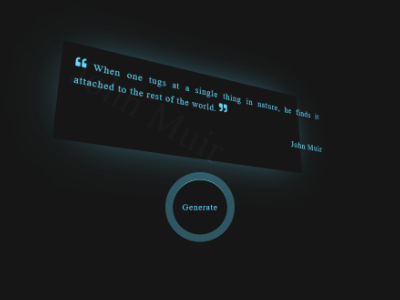

# Random quote project

## Table of Contents

1. [About the project](#🚀about-the-project)
* [Built with](#built-with)
2. [Get started](#get-started)
3. [Contact](#contact)

## 🚀 About-the-project

This a random quote project, it generates randomly a quote from an API.
This a project during my training at Becode.org, to show my skills 🧠.

### 🛠 Built with

* 

* 

* 

* 

* 

## ⚡️ Get started

* Clone the repository:
    ```gitbash
    git clone git@github.com:ElmiriYounes/Project-RandomQuote-React-NodeJS.git
    ```

* Install NPM packages in the root for nodejs and in the folder "view" for react:
    ```gitbash
    npm install 
    ```

* Launch the project (in the folder "view"):
    ```gitbash
    npm start
    ```

## 💬 Contact

El miri younes - elmiri.younes@hotmail.com